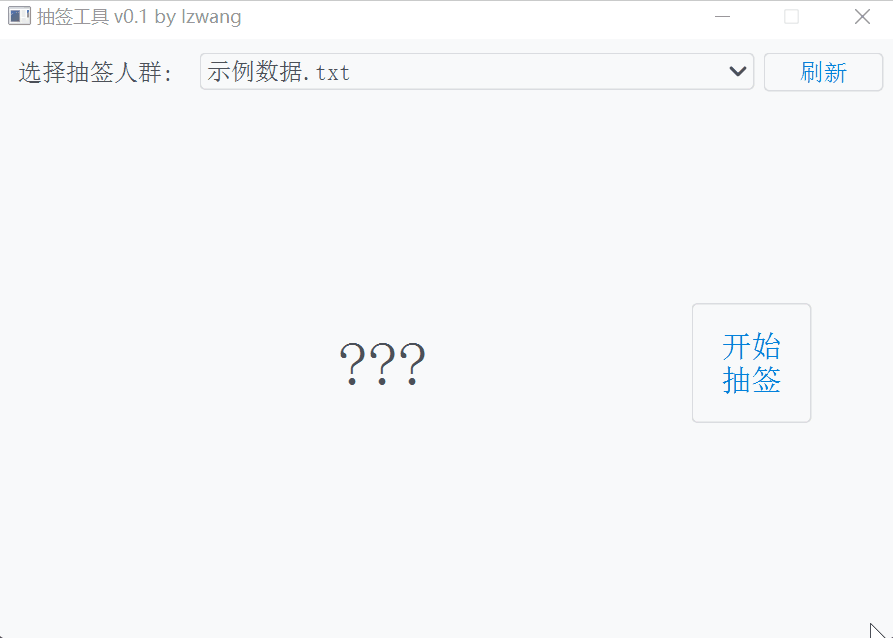

# 简易抽签工具

## 效果



## 使用

将需要抽签的人员名单写入到txt文件中，并放置于和软件同一文件夹即可。如果有多份人员名单，写入多个txt文件即可，然后点击软件的刷新按钮即可加载出来。

## 开发

### 安装依赖

```shell
pip install -r requirements.txt
```

### 项目结构

- 入口文件: `ballot.py`
- UI相关: `window.py`
- 抽签源码: `worker.py`
- 图标文件: `ballot.ico`

### 打包

```shell
pyinstaller -F -w -i ballot.ico --clean --win-private-assemblies ballot.py
```